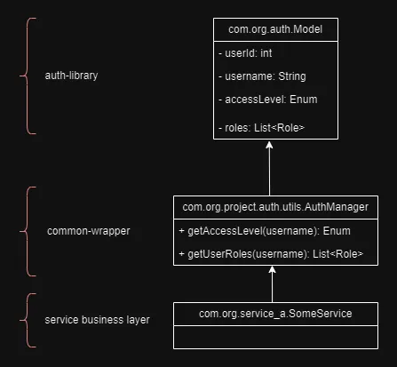
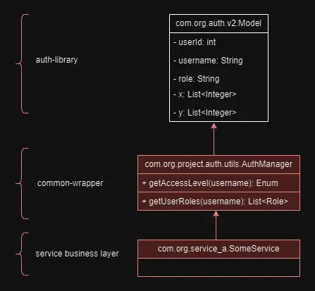
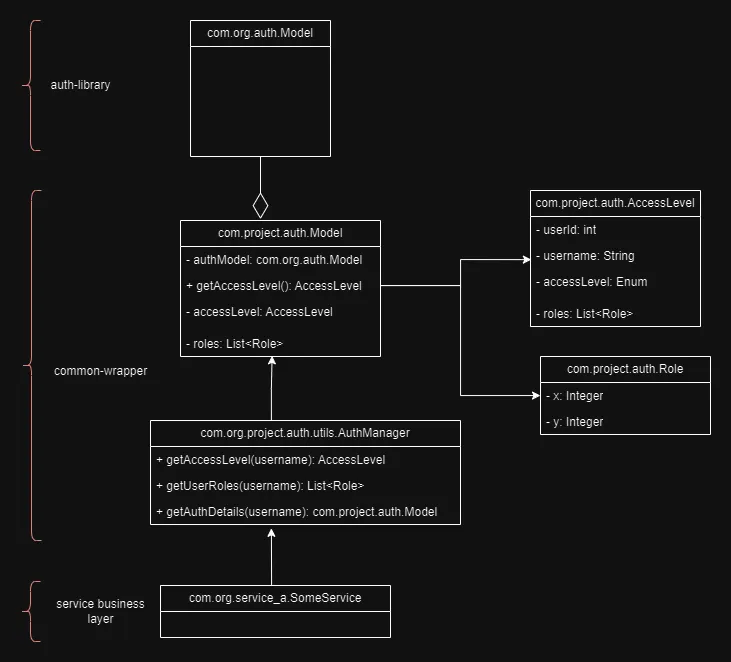

+++
title = 'Auth Wrangling: Taming Microservices with the Adapter Pattern'
description = 'Discover how we used the Adapter Pattern to solve authorization challenges across multiple microservices and ensure maintainability.'
date = 2024-06-14T11:17:34+05:30
draft = false
categories = [ "Clean Code", "Design Patterns", "Software Development", "Microservice Architecture" ]
tags = [ "design patterns", "software architecture", "microservice design", "adapter pattern", "microservices", "authorization", "java", "code refactoring", "clean code", "gangs of four" ]
showViews = true
showLikes = true
showComments = true
+++

In software engineering, design patterns are essential tools that help us solve
common design problems in a standardized way. One such powerful pattern is the
Adapter Pattern.

_")

In this blog post, **"Auth Wrangling: Taming Microservices with the Adapter
Pattern"**, we explore a real-world challenge that I encountered while
integrating an organization-wide authorization service across 14-15
microservices. Initially, leveraging a common library for authorization seemed
like a practical approach. However, frequent updates to the underlying auth
library led to a maintenance nightmare, forcing us to modify each service
repeatedly.

To address this issue, we turned to Adapter Pattern - a simple yet powerful
design pattern that helped us abstract and encapsulate changes, ensuring our
microservice remained robust and adaptable. This post provides a detailed
account of the problem, our solution, and lessons learned

Ideal for developers looking to understand practical applications of design
patterns in microservices architecture, this post also highlights the benefits
of the Adapter Pattern and shares valuable insights from our experience. For me,
this real-life example is one scenario where we understand the use and tradeoffs
we make when we talk about and adapt **clean code** in our codebase.

## The Problem

As with many organizations, we had an org-wide service that provided roles
associated with a given username. While each service had its complexities, for
this post, roles as a response to a username input will suffice to illustrate
the problem. This legacy service exposed SOAP APIs for consumption by other
applications. Our team was responsible for managing around 14-15 microservices,
all of which needed user role information for data visibility purposes.

To streamline usage, handle API authentication/authorization, implement rate
limiting, and manage caching strategies, the team provided a wrapper library for
the underlying authorization service. To further simplify integration with these
microservices, our team developed an additional library encapsulating the
auth-wrapper library, adding all common and required functionalities, and making
it easy for all microservices to consume. This also became useful for other
teams in our project who could consume this library.

The auth-library provided models to represent the request/response. Different
APIs had different models and helper functions. As I mentioned, it's much more
than a username and a list of roles.

As part of a larger initiative, the entire organization was moving towards more
cloud-native designs. The auth team too upgraded their platform and provided a
new version of the auth-wrapper library.

Our team started the initiative, and I began working on proofs of concept (POCs)
to understand the required changes. We had documents from different platforms
and integration teams, and I followed the guidelines for the upgrade.

Even though we were one of the first teams to adopt this new platform, we have
details documentation from platform and arch teams.

_Should be a piece of cake right?_ _Hold my beer...!_

_")

The issue arose when I tried to upgrade the auth-wrapper in the common jar. All
hell broke loose. What was supposed to be a 2-hour job (mostly running
pipelines) ended up taking a week.

The common library exposed the models from the auth-wrapper directly. Since the
auth-library upgrade included breaking changes, our models changed completely:

- Enums were replaced by strings and vice-versa.
- Some fields were removed.
- New fields were added.
- Roles were replaced with other internal constructs used to derive roles.
- Package names for classes changed.

### The Real Problem

The immediate action I took was to ask the team to stop using the bad version we
had in the artifactory, the one built with breaking changes. We were using
timestamps as versions, so a major version upgrade for the common-lib was not an
option.

Digging deep into the code, I realized two critical design issues:

- The common library was exposing the underlying models from the auth-library.
- The services, having no other option, were using these models directly.

With changes in model structure, package names, enums replaced by strings, etc.,
it was bound to break. The very reasons we created the common library—less work
for upgrades, common functionalities, and control over the underlying
library—were undermined by the design decision to expose and return models from
the underlying library. Consequently, we ended up in the exact opposite
situation.

To make things worse, since the library exposed the internals, few of the
services started using the models directly in the code to perform auth logic,
which not only breaks the build but the logic too.

## Solution

### Easy Way Out

The easy way out is to replace the old models with the new ones, fix the
imports, make some changes in all the services(all 14 of them), and call it a
day. This would still be 3-4 days of work. However, by the time the next upgrade
comes around, I might not be here to handle it, the team might not be here, or
the project might not exist at all!

But this was a chance, a chance to put some **Clean Code** and throw out the
dirty laundry!

### Time for some Clean Code

The problem arose from the fact, that we created a wrapper with functionalities
used across the services, but we never wrapped the internals. The library
directly exposed the internals and hence our implementations depended on it.

The first step, and the most difficult one, was to remove this dependency and
create a proper wrapper. Once we solve this, solving the problems at the service
end becomes much easier.

Like I said before, other than these changes, a couple of breaking business
changes were done, which needed fixes in our common library logic, but that is
not what we are discussing here.

The solution to this mess was to create **Adapters** for the internal models and
expose those. This approach saves us from having to touch any services, other
than simply updating them to use the new version of the common library.

Previously Enum was representing **AccessLevel**, and the **Role** class was a
wrapper of two integers that represented some more business access(let's call it
X and Y). Each of these together and sometimes separately told us the data
visibility of the user.

Well, as we can see `accessLevel` has been renamed to `role`, which is not a
string anymore. The `roles` have been bisected into two separate lists of
`X and Y`, the combination of both used to define a Role. Now this logic needs
to be handled at our end to make our code BAU..!

The answer to this is **Adapter Pattern**, which encapsulates and abstracts the
internals of the underlying library, exposing a custom interface for all
services to work with. This ensures that no service needs to ever change with
any upgrades required in the future.

## What is Adapter Pattern

According to the GoF (Gang of Four) book, also called **wrapper pattern**, the
intent and motivation behind this pattern is:

> Convert the interface of a class into another interface clients expect.
> Adapter lets classes work together that couldn't otherwise because of
> incompatible interfaces.
>
> Sometimes a toolkit class that's designed for reuse isn't reusable only
> because its interface doesn't match the domain-specific interface an
> application requires.

In simple terms, we have an interface to work with (auth-library) that does not
match the interface required by our services. To mitigate this issue, we create
an Adapter. A classic example is the use of adapters to make your Mac's USB-C
ports work with USB ports, HDMI cables, etc., or phone charging adapters used to
make a US-bought charger usable in EU sockets. The phone charger itself is
called an adapter because it adapts the power from the source according to the
requirements of your phone. Probably, the pattern gets its name from the same
concept.

A good place to read more about it and refer to UML diagrams is this
[blog post by java-design-patterns by Ilkka Seppälä](https://java-design-patterns.com/patterns/adapter/).

## Back to the problem

Introducing a simple layer between the internals of the auth-library and the
AuthManager completely decouples the services from the internal library.

No matter what changes come, changes in field names, changes in the semantics of
fields, change in types of fields, etc in the `Model` from the auth-library, the
**only class** we need to touch is the `org.project.auth.Model` class to change
to adapt the incoming model to our needs.

This also ensures we stick to the `Single Responsibility Principle`, (well we
still might need to change the AuthManager class, but that's a business change
and not a design change)

Once we made this change and were happy with our tests for the common library,
decoupling existing services to work with the new library was rather easy.

## Conclusion

By implementing the Adapter Pattern, we were able to decouple our services from
the underlying auth-library, making our system more robust and maintainable.
This approach ensured that future changes to the auth-library would have minimal
impact on our services, adhering to clean code principles and the Single
Responsibility Principle. Adopting the Adapter Pattern proved to be a practical
and effective solution to a complex problem, reinforcing the value of design
patterns in software development.

There is an interesting rant about clean code and performance by
[Casey Muratori called "Clean" Code, Horrible Performance](https://www.youtube.com/watch?v=tD5NrevFtbU),
which is a must-watch as it highlights the trade-offs between clean code and
performance. On the other hand,
[Uncle Bob's talks on Clean Code](https://www.youtube.com/watch?v=7EmboKQH8lM&list=PLmmYSbUCWJ4x1GO839azG_BBw8rkh-zOj)
provides a strong case for maintaining clean, readable, extensible and
maintainable code.

For me personally, like any other aspect of software design, it's a tradeoff.
Casey focuses on game development, where performance is critical, and
maintainability and extensibility might be secondary. For enterprise
applications, maintainability and extensibility is crucial, as things are
constantly changing and evolving. Integrations may fall apart, new integrations
are continuously added, and business requirements change every few sprints.
Balancing clean code and performance depends on the context and specific needs
of the project(we have all been there)!!

Balancing clean code and performance depends on the context and specific needs
of the project.

## License

**Content License:** This work is licensed under the
[Creative Commons Attribution-NonCommercial-NoDerivatives 4.0 International License](http://creativecommons.org/licenses/by-nc-nd/4.0/).
You are free to share this content as long as it is attributed to me,
non-commercial in nature, and remains unaltered.

**Code License:** The code provided in this blog post is released under the
[MIT License](https://opensource.org/licenses/MIT). Feel free to use it in your
projects and applications.

A copy of the same can be found
[here](https://github.com/priyakdey/priyakdey.github.io/blob/main/LICENSE).
