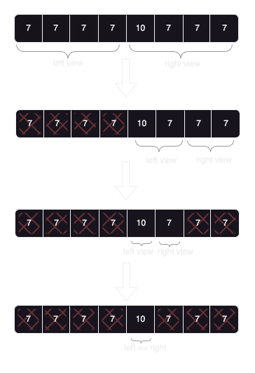
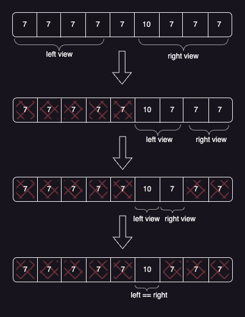

+++
title = 'Binary Search Mastery: Finding the Index of the Large Integer in a Special Array'
description = 'Learn to apply binary search to solve the challenging LeetCode problem of finding the index of the large integer in a special array. Master binary search techniques, optimize API calls, and delve into efficient algorithm design.'
date = 2024-05-16T13:20:00+05:30
draft = true
categories = [ "Software Engineering", "Algorithms" ]
tags = [ "programming", "problem solving", "datastructure", "algorithms", "binary search", "leetcode", "python", "coding", "tech" ]
showViews = true
showLikes = true
+++

This week, I’m diving into a recent solve on LeetCode:
[Find the Index of the Large Integer](https://leetcode.com/problems/find-the-index-of-the-large-integer/)
using the elegant
[Binary Search Algorithm](https://en.wikipedia.org/wiki/Binary_search_algorithm).

# Problem Statement

We have an integer array `arr`, where all the integers in `arr` are equal except
for one integer which is larger than the rest of the integers. You will not be
given direct access to the array, instead, you will have an API `ArrayReader`
which have the following functions:

- `int compareSub(int l, int r, int x, int y)`: where
  `0 <= l, r, x, y < ArrayReader.length(), l <= r and x <= y`. Th e function
  compares the sum of sub-array `arr[l..r]` with the sum of the sub-array
  `arr[x..y]` and returns:
  - 1 if `arr[l]+arr[l+1]+...+arr[r] > arr[x]+arr[x+1]+...+arr[y]`.
  - 0 if `arr[l]+arr[l+1]+...+arr[r] == arr[x]+arr[x+1]+...+arr[y]`.
  - -1 if `arr[l]+arr[l+1]+...+arr[r] < arr[x]+arr[x+1]+...+arr[y]`.
- `int length()`: Returns the size of the array.

You are allowed to call `compareSub()` 20 times at most. You can assume both
functions work in `O(1)` time.

Return the _index_ of the array `arr` which has the largest integer.

[Link to the problem](https://leetcode.com/problems/find-the-index-of-the-large-integer/)


This is a leetcode premium problem 

# Approach and Visualization

Let alone the expected time complexity, given the constraint of abstraction,
scanning the array for the answer is not feasible. We need a more efficient
approach.

The answer is `Binary Search`, just like the title says! Let's delve into why
and how to apply it.

For the underlying array, we are given two APIs:

- `compareSub`: This method compares the sums of two slices from the array.
- `length`: Provides us with the length of the backing array.

Well I use the term `array` here, but we _really don't care_ if it is backed by
a traditional array, linked list or some other vodoo. All we care about is the
APIs we have.


Abstractions are meant to not think of internals. But at times, we do need to
care about it. Like every other thing in life, its contextual. 

> ## What is Binary Search
>
> Binary Search, as the name suggests is about **searching** for something in a
> space; the space can be divided into two views (binary!), and some property
> comparison can help us tell which one of the two views _might_ contain the
> element of concern.
>
> It is an algortithm which help us reject spaces which **surely do not**
> contain the element of concern. This rejection mechanism helps reduce our
> search space, usually by half giving amortized time compleixty as `O(log n)`.
>
> There are cases with 2D matrix, where same rejections can lead to `O(m + n)`
> compared to `O(m * n)`, so always logarithm search is not applied.
>
> The whole idea is to reject spaces which does not contain the element.

**Lets take an example and visualize the problem.**



In above diagram, we have taken an array of length 8 - [7, 7, 7, 7, 10, 7, 7,
7]. Length here is important, as you need to eliminate spaces and move pointers
around according to length of the slice.

Consider an `array of length 8: [7, 7, 7, 7, 10, 7, 7, 7]`. Here’s how we can
use compareSub:

1. **Iteration 1**: Taking the whole array as the search space
   (`left = 0, right = 7`), we can get the mid as `3`. Since this is
   `even length` slice, we can divide the slice equally into two equal views.
   Use `compareSub` method to compare sum of `left slice[left:mid]` with
   `right slice[mid + 1: right]`. This should tell us, since only one integer is
   larger than other, it has to be on the slice which has higher sum. According
   move pointers. If left slice has higher sum, move `right to mid` or
   `left to mid + 1` if otherwise (our case). Moving the pointers correctly is
   important, and hence visualization works great for any problem solving.
2. **Iteration 2**: If you understand iteration1 and visualize the diagram
   above, it is pretty much easy to understand the recursion pattern now, we
   need to simply move the pointers around and keep eliminating elements which
   are surely not our target element.
3. **Iteration x**: Skipping all other iterations, as self-explanatory, coming
   to the last step, we need to know when to stop. For even length slice, when
   `left == right` is when we need to stop, and for odd length, we stop if
   `sum of left slice == sum of right slice`, which we can see in the below
   diagram.

Below diagram shows an example with odd length array/slice where it becomes a
little easy to find the exit point.



# Code Implementation

```python
class Solution:
    def getIndex(self, reader: "ArrayReader") -> int:
        left, right = 0, reader.length() - 1

        index = -1

        while left <= right:
            slice_length = right - left + 1
            mid = left + (right - left) // 2

            if slice_length & 1 == 0:
                compare_sub = reader.compareSub(left, mid, mid + 1, right)
                if compare_sub == 1:
                    right = mid
                elif compare_sub == -1:
                    left = mid + 1
                else:
                    # should never hit this if slice length is even
                    raise Exception("something went wrong")
            else:
                if left == right:
                    index = mid
                    break
                compare_sub = reader.compareSub(left, mid - 1, mid + 1, right)
                if compare_sub == 1:
                    right = mid - 1
                elif compare_sub == -1:
                    left = mid + 1
                else:
                    index = mid
                    break

        return index
```
