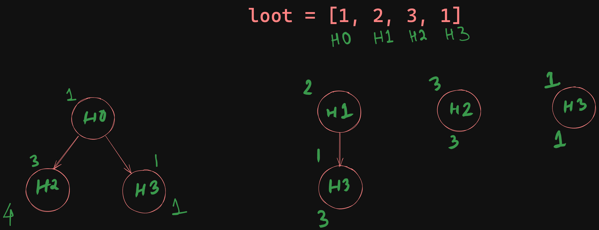
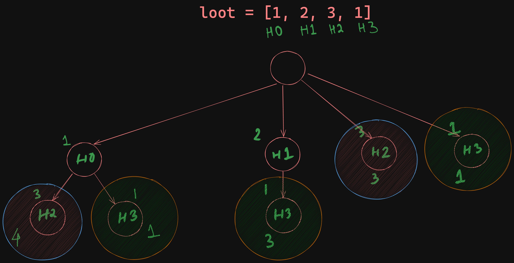
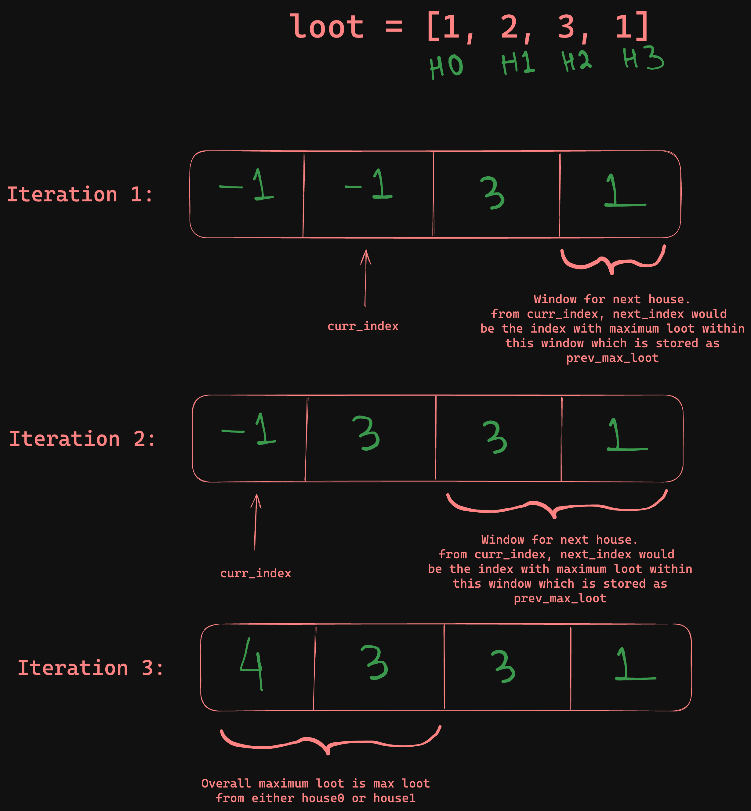

+++
title = 'Unlocking Dynamic Programming with the House Robber Challenge'
description = 'House Robber - Dynamic Programming Problem solving from leetcode'
date = 2024-05-10T00:47:34+05:30
draft = false
categories = [ "Software Engineering" ]
tags = [ "programming", "problem solving", "datastructure", "algorithms", "dynamic programming", "recursion", "memoization", "tabulation", "leetcode", "python", "coding", "tech" ]
showViews = true
showLikes = true
+++

The [House Robber](https://leetcode.com/problems/house-robber/) problem from
[LeetCode](https://leetcode.com) offers an excellent illustration of how dynamic
programming can be applied to optimize solutions.

_")

In this blog post I will walk through my process of understanding and solving a
problem using a dynamic programming approach, using this problem as example.

## Problem Statement

You are a professional robber planning to rob houses along a street. Each house
has a certain amount of money stashed, the only constraint stopping you from
robbing each of them is that adjacent houses have security systems connected and
**it will automatically contact the police if two adjacent houses were broken
into on the same night**.

Given an integer array `nums` representing the amount of money of each house,
return the **maximum amount of money you can rob tonight without alerting the
police**.

[Link to Leetcode Problem](https://leetcode.com/problems/house-robber/)

## Breaking Down the Problem and Visualizing Solutions

The problem presents two primary challenges:

- **Avoiding Detection**: If you rob a house at position x, you cannot rob the
  houses directly next to it (i.e., x-1 and x+1).
- **Maximizing the Loot**: You need to ensure that the total amount of money
  robbed is maximized.

### Decision Tree Visualization

To tackle these challenges, visualize the problem with a
[Decision Tree](https://en.wikipedia.org/wiki/Decision_tree), which will help
map out all possible outcomes based on your choices at each step.



The decision tree above demonstrates the various paths you might take based on
the initial choice between robbing `house0` or `house1`. This is because
starting from `house2` or beyond, without considering `house0` or `house1`,
would potentially overlook simpler, more lucrative options. Each branch of the
tree represents a decision point where you choose either to rob a house or skip
it, leading to a new set of possibilities.

By exploring all viable paths through this decision tree, you can identify the
sequence of choices that maximizes your total haul without triggering any
alarms.

## Code Walkthrough

### Recursive Approach

Our goal is to maximize our loot starting from either house0 or house1, as these
positions offer the highest potential rewards based on our
[Decision Tree Visualization](#decision-tree-visualization). This problem
inherently resembles a tree structure, making recursion a natural solution.


Understanding recursion is crucial in tackling such problems. For a deeper dive
into recursion, check out this
[resource](<https://users.cs.utah.edu/~germain/PPS/Topics/recursion.html#:~:text=Recursion%20means%20%22defining%20a%20problem,%2B%20F(i%2D2)>)
for more details. 

```python

from typing import List


class Solution:
    def rob(self, nums: List[int]) -> int:
        if nums is None or len(nums) == 0:
            raise Exception("Invalid arguments")

        if len(nums) == 1:
            return nums[0]
        # 2 houses, can just loot either of the two
        if len(nums) == 2:
            return max(nums[0], nums[1])

        # recursive solution
        return self.rob_rec(nums, 0)

    def rob_rec(self, nums: List[int], curr_index: int) -> int:
        """Recursive approach"""

        # Guard against overshooting the array boundary and potential stackoverflow
        if curr_index >= len(nums):
            return 0

        # BASE CASE: When looting the last or second last house, there
        # are no more options to loot in the right. Refer to decision tree.
        if curr_index == len(nums) - 2 or curr_index == len(nums) - 1:
            return nums[curr_index]

        # do not loot this house and move on to the next house
        max_loot = self.rob_rec(nums, curr_index + 1)

        # consider looting current house
        for next_index in range(curr_index + 2, len(nums)):
            max_loot = max(max_loot, nums[curr_index] + self.rob_rec(nums, next_index))

        return max_loot


solution = Solution()


def assert_test(nums: List[int], expected: int) -> None:
    actual = solution.rob(nums)
    assert actual == expected, f"expected {expected} but got {actual}"


if __name__ == "__main__":
    for nums, expected in ([1, 2, 3, 1], 4), ([2, 7, 9, 3, 1], 12):
        assert_test(nums, expected)
```

This solution, while straightforward, hits a **Time Limit Exceeded** error
because it operates with an exponential time complexity O(2<sup>n</sup>) and
O(n) stack space due to deep recursive calls.

What can be done about this? This takes us to second step - caching or
memoization(if you don't want to offend your comp soy neighbour!)

### Memoization

[Memoization](https://en.wikipedia.org/wiki/Memoization) is a term used in
software. It simply means, caching return value of a function based on the input
to avoid redundant computations, significantly speeding up our solution. Well,
there are caveats to it but that is for another day.



The above diagram illustrates repeated calculations in the decision tree. By
caching these results, we avoid redundant branches and optimize our approach.

As evident from the above tree, we are computing same branches or sub branches
multiples times. If we can cache the result, it helps us optimize the solution.
`Key-Value` based data-structure like `Map` or `Dict` in python helps us store a
value against some key, and retrives in `O(1)` time. We can start there, but a
closer look into the function, we can see that the function `rob_rec` has two
inputs (other than self):

- `nums`: The actual list
- `curr_index`: The index at which current computation will take place.

Out of the two, only `curr_index` is the variable input and depending on it, the
return value changes. Further more, the value of `curr_index` will be in the
range `0, len(nums) - 3`; we do not need to cache the base cases. Only **one
changing variable** should give us the hint of using a 1D array the cache.

```python
class Solution:
    def rob(self, nums: List[int]) -> int:
        if nums is None or len(nums) == 0:
            raise Exception("Invalid arguments")

        if len(nums) == 1:
            return nums[0]
        # 2 houses, can just loot either of the two
        if len(nums) == 2:
            return max(nums[0], nums[1])

        # recursive solution
        # return self.rob_rec(nums, 0)

        # recursive solution with memoization
        cache: List[int] = [-1 for _ in nums]
        return self.rob_rec_memo(nums, 0, cache)

    def rob_rec_memo(self, nums: List[int], curr_index, cache: List[int]) -> int:
        """Recursive approach with memoization"""

        if curr_index >= len(nums):
            return 0
        if curr_index == len(nums) - 2 or curr_index == len(nums) - 1:
            return nums[curr_index]

        if cache[curr_index] != -1:
            # result for this index has been calculated, return from cache
            return cache[curr_index]

        max_loot = self.rob_rec_memo(nums, curr_index + 1, cache)

        for next_index in range(curr_index + 2, len(nums)):
            max_loot = max(
                max_loot, nums[curr_index] + self.rob_rec_memo(nums, next_index, cache)
            )

        # cache the max loot at curr_index for later computations
        cache[curr_index] = max_loot
        return max_loot

```

With memoization, our recursive solution becomes feasible and efficient.

**But could we still improve? Absolutely.**

While recursion has its merits, it also introduces overheads such as memory
consumption and potential stack overflow risks. Transitioning to a loop-based
approach might further enhance performance by leveraging a
[Bottom-Up Apprach](https://en.wikipedia.org/wiki/Bottom%E2%80%93up_and_top%E2%80%93down_design)
, reducing overhead and improving clarity.

What we did here is a
[Top-Down Approach](https://en.wikipedia.org/wiki/Bottom%E2%80%93up_and_top%E2%80%93down_design),
looking at the problem from the top, disecting it, going one level down and then
breaking it down further. This approach works, but there is better way.

**What if we can study the cache and build it from bottom-up?**.

This takes us to our next step - tabulation.

### Tabulation

Returning to our [Decision Tree Diagram](#decision-tree-visualization), we
previously tackled the problem recursively from the top of the tree, exploring
all possible paths for each index. Given the dependency of larger problems on
the results of smaller subproblems, a bottom-up approach is more appropriate. By
solving the simplest problems first, we can build our solution incrementally.

```python
from typing import List


class Solution:
    def rob(self, nums: List[int]) -> int:
        if nums is None or len(nums) == 0:
            raise Exception("Invalid arguments")

        if len(nums) == 1:
            return nums[0]
        # 2 houses, can just loot either of the two
        if len(nums) == 2:
            return max(nums[0], nums[1])

        # recursive solution
        # return self.rob_rec(nums, 0)

        # recursive solution with memoization
        # cache: List[int] = [-1 for _ in nums]
        # return self.rob_rec_memo(nums, 0, cache)

        # tabulation
        return self.rob_tab(nums)

    def rob_tab(self, nums: List[int]) -> int:
        """Bottom up approach"""

        max_loot: List[int] = [-1 for _ in nums]
        max_loot[-1] = nums[-1]
        max_loot[-2] = nums[-2]

        prev_max_loot = max_loot[-1]  # for house_-3, we can only loot house_-1

        for curr_index in range(len(nums) - 3, -1, -1):
            curr_loot = nums[curr_index] + prev_max_loot
            max_loot[curr_index] = curr_loot
            # sliding window to avoid O(n) operation to find next max
            prev_max_loot = max(max_loot[curr_index + 1], prev_max_loot)

        return max(max_loot[0], max_loot[1])

```

We have simply renamed `cache` as `max_loot`. This method initializes a max_loot
array where each index represents the maximum loot attainable from that house to
the end. We start from the rightmost house and progress leftwards. The
prev_max_loot variable tracks the maximum possible loot from two houses down,
optimizing our loop to avoid recalculating max values continuously, using a
sliding window technique in O(1) time.

Refer to the diagram below for illlustration.



From a visual approach through recursive problem-solving and memoization, we've
constructed our solution from the ground up—tabulation. This not only clarifies
the progression of logic but also enhances computation efficiency.

### Tabulation Space Optimization

While our tabulation method is efficient in time complexity `O(n)`, it still
uses `O(n)` space. To optimize further, we only need a couple of states at any
time due to the problem's nature.

**Do we really need all states?** - NO !!

If we look carefully, we can see that, for max loot at curr_index, we need to
know which house to loot next which can be from [curr_index + 2, len(nums) - 1].
And for next iteration, [curr_index + 1] comes into the possible jump window. So
we can keep track of two things -

- the next index to jump to, rather the loot at the next index to jump to.
- curr_index + 1 position loot for using it in next iteration.

The final solution comes out to be..

```python
from typing import List


class Solution:
    def rob(self, nums: List[int]) -> int:
        if nums is None or len(nums) == 0:
            raise Exception("Invalid arguments")

        if len(nums) == 1:
            return nums[0]
        # 2 houses, can just loot either of the two
        if len(nums) == 2:
            return max(nums[0], nums[1])

        # recursive solution
        # return self.rob_rec(nums, 0)

        # recursive solution with memoization
        # cache: List[int] = [-1 for _ in nums]
        # return self.rob_rec_memo(nums, 0, cache)

        # tabulation
        # return self.rob_tab(nums)

        # tabulation with space optimization
        return self.rob_tab_with_space_optimization(nums)

    def rob_tab_with_space_optimization(self, nums: List[int]) -> int:
        """Bottom up approach- Tabulation without the extra space"""

        non_adjacent_max_loot, adjacent_max_loot = nums[-1], nums[-2]

        for curr_index in range(len(nums) - 3, -1, -1):
            curr_loot = nums[curr_index] + non_adjacent_max_loot
            non_adjacent_max_loot = max(non_adjacent_max_loot, adjacent_max_loot)
            adjacent_max_loot = curr_loot

        return max(non_adjacent_max_loot, adjacent_max_loot)

```

This streamlined version reduces the space complexity to `O(1)`by maintaining
only two variables: one for the loot that includes the current house and another
for the maximum loot of the next possible houses.

**This optimization encapsulates the essence of dynamic programming by
minimizing both time and space complexity.**

All code used above can be found in the file
[house_robber.py](./house_robber.py)

## Conclusion

In this post, we explored the dynamic programming technique through the "House
Robber" problem, evolving our approach from a simple recursive method to a more
efficient tabulation method with space optimization. The journey through these
methods not only enhances our problem-solving skills but also deepens our
understanding of dynamic programming concepts.

I encourage you to apply these strategies to similar problems. Happy coding!

## Additional Resources

For further reading and practice on dynamic programming and other algorithms, I
recommend the following resources:

1. [Dynamic Programming - LeetCode](https://leetcode.com/tag/dynamic-programming/) -
   A collection of problems to practice dynamic programming.
2. [Introduction to Dynamic Programming - GeeksforGeeks](https://www.geeksforgeeks.org/dynamic-programming/) -
   A comprehensive guide to understanding and applying dynamic programming
   techniques.
3. [MIT's Introduction to Algorithms](https://ocw.mit.edu/courses/electrical-engineering-and-computer-science/6-006-introduction-to-algorithms-spring-2020/) -
   Explore algorithms at a deeper level with MIT's free course materials.
4. [String Diff in Python By Tsoding](https://www.youtube.com/watch?v=tG4IeY01-xw)
5. [neetcode.io youtube for visual problem-solving techniques](https://www.youtube.com/watch?v=g0npyaQtAQM&list=PLot-Xpze53lcvx_tjrr_m2lgD2NsRHlNO)
6. [Fundamentals of Dynamic Programming by Avik Das](https://www.linkedin.com/learning/fundamentals-of-dynamic-programming/the-importance-of-dynamic-programming)

If you found this post helpful, please consider sharing it on social media and
drop a like to comment. Follow me for more updates and discussions on complex
programming topics. Let's connect and grow our knowledge together!

## License

**Content License:** This work is licensed under the
[Creative Commons Attribution-NonCommercial-NoDerivatives 4.0 International License](http://creativecommons.org/licenses/by-nc-nd/4.0/).
You are free to share this content as long as it is attributed to me,
non-commercial in nature, and remains unaltered.

**Code License:** The code provided in this blog post is released under the
[MIT License](https://opensource.org/licenses/MIT). Feel free to use it in your
projects and applications.

A copy of the same can be found
[here](https://github.com/priyakdey/priyakdey.github.io/blob/main/LICENSE).
