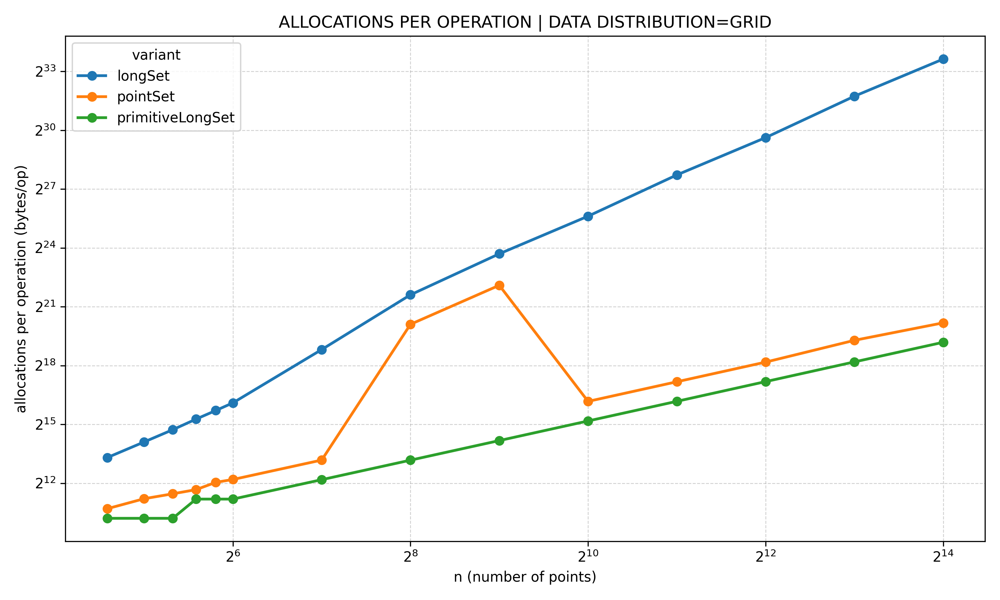
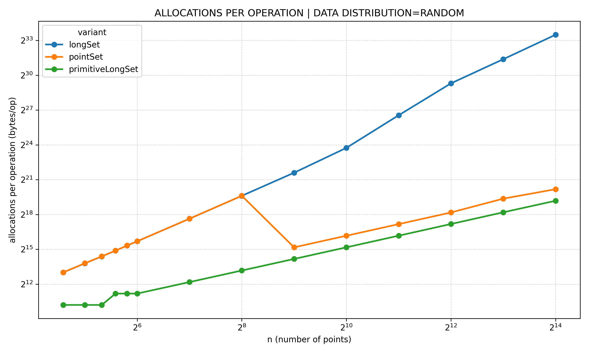
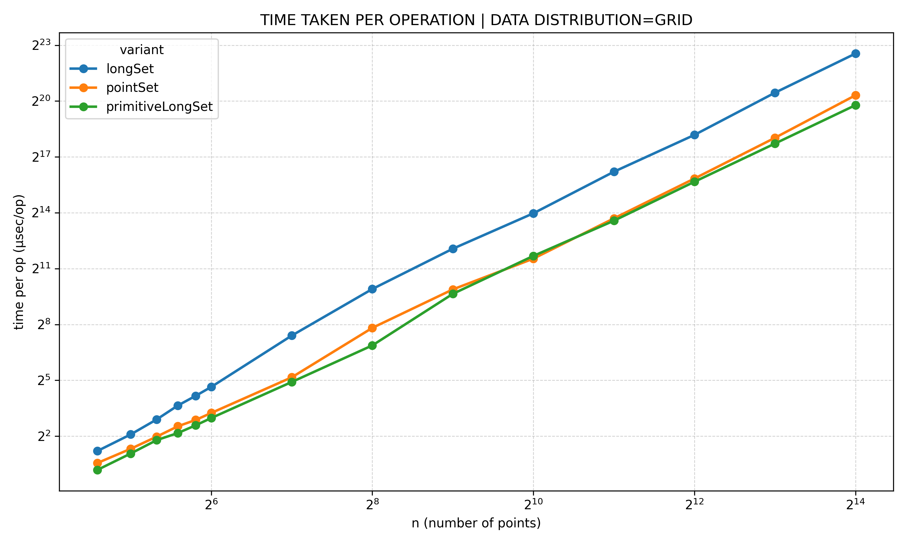
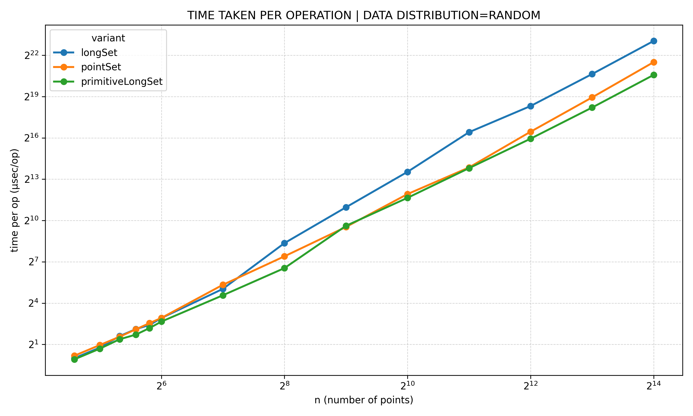

+++
title = 'Counting Squares: When Geometry Meets Performance'
description = "A deep dive into counting squares from a set of points — from naive geometry to optimized algorithms. We analyze time complexity, memory behavior, data structures, and real benchmarks to understand what actually makes code fast."
date = 2026-01-22T22:48:52+05:30
draft = false
categories = []
tags = ["algorithms", "computational-geometry", "performance", "time-complexity", "memory-optimization", "datastructure", "benchmarking","hashing","java"]
showViews = true
showLikes = true
showComments = true
math = true
+++



Counting squares sounds like a toy problem.

Given a set of points on a 2D plane, how many squares can you form using 
those points as vertices? No tricks. No transformations. Just geometry.

From a correctness perspective, this problem is straightforward. Geometry 
tells us exactly what a square is. The challenge only appears when we stop 
asking _"Is this correct?"_ and start asking _"Is this correct?"_ and start asking _"How does this behave when the input grows?"_

This post is not about clever interview tricks or theoretical optimality.
It is an exploration of **algorithmic structure, data representation, and 
memory behavior**, and how those choices surface in **real benchmarks**.

We will start with a solution that is unquestionably correct.
Then we will progressively change _how_ the problem is represented and solved,
measuring the impact at every step.

---

## What this post actually does

This is not a "find the optional solution and move on" post.

We treat **Count Squares** as a controlled performance experiment:
- **Algorithmic progression**: reduce the search space using geometry
- **Implementation progression**: keep the algorithm fixed, but vary representation and data structures.
- **Benchmark driven conclusions**: no intuition-only arguments - everything is measured.

The core idea is simple:
> Once algorithms share the same asymptotic complexity, **representation
> and memory layout dominate performance**

---

## Problem Statement

We are given a set of 2D points with integer coordinates:

$$
P = \{(x_1, y_1), (x_2, y_2), \ldots, (x_n, y_n)\}
$$

A square is defined by four distinct points such that:
- All four sides have equal length
- The two diagonals are equal in length
- The diagonals intersect at their midpoint and are perpendicular

Squares may be axis-aligned or rotated.
A single point may participate in multiple squares.

The task is to **count the number of distinct squares** that can be formed 
using the given points.

---

## The Naive Geometry Solution

The most direct solution is also the most expensive.

A square is defined by four points, so the brute-force approach is obvious:

1. Enumerate every 4-point combination
1. Check whether those four points form a square
1. Count how many combinations satisfy the square conditions

There are \\\(\binom{n}{4}\\\) such combinations which gives an \\\(O(n^4)\\\) solution.

From a correctness standpoint, this solution is hard to beat.
If a square exists, this method will find it.

Given four points, we compute all pairwise squared distances - exactly six values.

For a valid square:
- The four smallest distances must be equal (the sides)
- The two largest distances must be equal (the diagonals)
- The diagonal length must be exactly twice the side length

We stay in squared-distance space to avoid floating-point arithmetic.

We may talk about the fixed size buffer allocation of 6 per iteration, but
there are workarounds to this. We can make the buffer static, but it gives
issues in multi-threaded environment. We can make it local to the instance,
but it will stil be an issue in multi-threaded environment.

This choice of allocation per iteration, adds overhead to the allocation time,
but the overall complexity remains same.

Anyone with an understanding of how powers work, can already see that this is 
a very slow algorithm. In fact, it is so slow, that we could not even 
benchmark inputs `> 50`.

The code is simple with a bunch of loops and almost zero-allocation, if we
can consider allocating the 6 slots of array in a synchronized fashion, but the
overall time complexity does not change.

```java

    public int countSquares(int[][] points) {
        long count = 0;
        for (int i = 0; i < points.length - 3; i++) {
            for (int j = i + 1; j < points.length - 2; j++) {
                for (int k = j + 1; k < points.length - 1; k++) {
                    for (int l = k + 1; l < points.length; l++) {
                        if (isSquare(points[i], points[j], points[k],
                                points[l])) {
                            count++;
                        }
                    }
                }
            }
        }

        return (int) (count / 2);
    }

    /**
     * Determines whether four points form a valid square.
     *
     * @param p1 first point
     * @param p2 second point
     * @param p3 third point
     * @param p4 fourth point
     * @return {@code true} if the points form a square, {@code false} otherwise
     */
    private boolean isSquare(int[] p1, int[] p2, int[] p3, int[] p4) {
        // NOTE: allocation can be made O(1), by sharing the buffer across
        // invocations. But that makes it thread-unsafe.
        // Making it thread-safe would increase the runtime - another classic
        // time-memory tradeoff.
        final long[] dist = new long[6];

        dist[0] = sqDist(p1, p2);
        dist[1] = sqDist(p1, p3);
        dist[2] = sqDist(p1, p4);
        dist[3] = sqDist(p2, p3);
        dist[4] = sqDist(p2, p4);
        dist[5] = sqDist(p3, p4);

        // NOTE: This adds to the runtime, but is negligible. In a bigger picture
        // this add O(1) complexity because of fixed size.
        Arrays.sort(dist);

        long side = dist[0];
        long diag = dist[4];
        if (side == 0) return false;

        boolean fourSidesEqual = dist[0] == dist[1]
                && dist[1] == dist[2] && dist[2] == dist[3];

        boolean twoDiagsEqual = dist[4] == dist[5];

        boolean correctRatio = diag == 2 * side;

        return fourSidesEqual && twoDiagsEqual && correctRatio;
    }

    /**
     * Computes the squared Euclidean distance between two points.
     * <p>
     * Squared distance is used to avoid floating-point arithmetic.
     *
     * @param p first point
     * @param q second point
     * @return squared distance between {@code p} and {@code q}
     */
    private long sqDist(int[] p, int[] q) {
        long dx = (long) p[0] - q[0];
        long dy = (long) p[1] - q[1];
        return dx * dx + dy * dy;
    }
```

---

## Geometry Unlock: Squares Are Defined by Diagonals

The first real improvement comes from changing __how we think about a square__.
A square is uniquely defined by its **two diagonal endpoints**.

Given two diagonal points:
$$
P_1(x_1, y_1), \quad P_2(x_2, y_2)
$$

The other two vertices of the second diagonal are:
$$
P_3 = \left(\frac{x_1 + x_2 + (y_1 - y_2)}{2}, \frac{y_1 + y_2 + (x_2 - x_1)}{2}\right)
$$

$$
P_4 = \left(\frac{x_1 + x_2 - (y_1 - y_2)}{2}, \frac{y_1 + y_2 - (x_2 - x_1)}{2}\right)
$$

This transforms the problem from **choosing 4 points out of n** to **choosing
2 points, computing the other 2 and lookup.**

That reduces the dominant work to \\\(O(n^2)\\\).

> [!TIP] Why do we double the values in our calculation?
> To avoid floating-point math, instead of divisions, we scale all coordinates
> by 2 upfront. This is to avoid the classic floating-point precision issue.
> You can read more about the [IEEE 754 spec here](https://docs.oracle.com/cd/E19957-01/806-3568/ncg_math.html).


## Diagonal-Based Implementation Using a Point Set

The problem to solve here is lookup, and the most common solution to it is
a HashMap or HashSet in our case. It guarantees an amortized \\\(O(1)\\\) lookup time.

> [!TIP]+ What is **amortized**?
> Well this post is not about HashMap and its implementation,
> so I am not going deep, but let's say - it means HashMaps gives us \\\(O(1)\\\) lookup
> time for most cases, but for certain cases - it may degrade to \\\(O(\log{n})\\\) or
> \\\(O(n)\\\) depending on its implementation and runtime behaviour.

But this solution is also kinda straight-forward. We encapsulate \\\(P_1(x_1, y_1)\\\), 
insert all points in a set, iterate over the list of points - considering them
as two points of a diagonal and perform a \\\(O(1)\\\) lookup for the computed vertices.

```java

    public int countSquares(int[][] points) {
        int length = points.length;
        Set<Point> set = HashSet.newHashSet(2 * length);

        for (int[] point : points) {
            // NOTE: we double the values to avoid divide by 2 and
            // avoid floating arithmetic
            set.add(new Point(2 * point[0], 2 * point[1]));
        }

        long count = 0;

        for (int i = 0; i < points.length - 1; i++) {
            int x1 = points[i][0], y1 = points[i][1];
            for (int j = i + 1; j < points.length; j++) {
                int x2 = points[j][0], y2 = points[j][1];

                int x3 = ((x1 + x2) + (y1 - y2));
                int y3 = ((y1 + y2) + (x2 - x1));
                Point p3 = new Point(x3, y3);

                if (!set.contains(p3)) continue;

                int x4 = ((x1 + x2) - (y1 - y2));
                int y4 = ((y1 + y2) - (x2 - x1));
                Point p4 = new Point(x4, y4);

                if (set.contains(p4)) count++;
            }
        }

        return (int) (count / 2);
    }

    /**
     * Immutable 2D point used for hash-based lookups.
     * <p>
     * Coordinates are stored in a scaled form (typically {@code 2 × original})
     * to allow midpoint and rotation computations to be expressed using integer
     * arithmetic only, avoiding division and floating-point precision issues.
     * <p>
     * Being a {@code record}, this type provides value-based equality and
     * hashing, making it suitable for use as a key in hash-based collections.
     *
     * @param x x-coordinate (scaled)
     * @param y y-coordinate (scaled)
     */
    private record Point(int x, int y) {
    }

```

This is where the solution should end. Interview done, the DSA courses paid off!!

**But the real fun has just begun. Performance problems have only just begun.**

From this point, all implementations share the same complexity: \\\(O(n^2)\\\).

This is where **datastructures, allocation patterns, and cache locality** 
start to matter more than asymptotic analysis.

Thus begins our journey down the rabbit hole.

This is the point where we stop thinking in terms of "algorithms" and start thinking in terms of "machines".
From here on, the asymptotics are fixed - what changes is how the CPU and memory subsystem experience the code.

---

## HashSet<Point>: The First Performance Trap

Using `HashSet<Point>` seems reasonable. It provides O(1) lookup and clean semantics.
But it comes with hidden costs:
- Each `Point` is an object
- Object allocation pressure increases GC activity
- `HashSet` stores references - pointer chasing
- Poor cache locality

---

## Packing Coordinates into Long

The next step is to remove objects entirely.

Instead of storing `Point(x, y)`, we can pack two 32-bit integer(int) 
in a single 64-bit integer(long). Having support for primitives `int` and `long`
from Java, these are more memory efficient.

```java
    key = (x << 32) ^ (y & 0xFFFFFFFF)
```

This gives:
- One primitive per point
- No object allocation
- Fewer cache misses.

> [!TIP]+ Why 32-bit packing is safe?
> Given the problem constrains -no point is more than 100 units from the
> origin. We can safely double each int and pack them in a long.

The code for this is very similar to the PointSet problem.

```java
    public int countSquares(int[][] points) {
        int length = points.length;

        Set<Long> set = HashSet.newHashSet(2 * length);
        for (int[] point : points) {
            long key = key(2L * point[0], 2L * point[1]);
            set.add(key);
        }

        long count = 0;

        for (int i = 0; i < points.length - 1; i++) {
            long x1 = points[i][0], y1 = points[i][1];
            for (int j = i + 1; j < points.length; j++) {
                long x2 = points[j][0], y2 = points[j][1];

                long x3 = ((x1 + x2) + (y1 - y2));
                long y3 = ((y1 + y2) + (x2 - x1));

                long x4 = ((x1 + x2) - (y1 - y2));
                long y4 = ((y1 + y2) - (x2 - x1));

                long p3 = key(x3, y3);
                long p4 = key(x4, y4);

                if (set.contains(p3) && set.contains(p4)) {
                    count++;
                }
            }
        }

        return (int) (count / 2);
    }


    /**
     * Packs two signed 32-bit integer coordinates into a single 64-bit key.
     * <p>
     * The high 32 bits store {@code x}, and the low 32 bits store {@code y}.
     * This encoding preserves equality and enables efficient hash-based lookups
     * without object allocation.
     *
     * @param x x-coordinate (scaled)
     * @param y y-coordinate (scaled)
     * @return packed {@code long} key representing the point
     */
    private long key(long x, long y) {
        return (x << 32) ^ (y & 0xFFFFFFFFL);
    }
```

---

## Comparing Point to Long Based Solution

On paper, we reduced our memory footprint. In Java, primitive arrays are still heap-allocated,
but we removed:
- per-element object allocation
- pointer-heavy layouts (values are stored contiguously)


But why should you take my words for it? We should be data-driven. We use [jmh](https://github.com/openjdk/jmh)
to prove our point. We use two different datasets - random and grid to perform
our analysis. And below is the memory footprint comparison of **Point based (pointSet)**
and **Long based solution (longSet)**.


  
  


On paper, this should have been a clean win.
We replaced a heap-heavy `Point` object with a single packed `long`.
Fewer objects. Smaller footprint. Better cache locality.

Yet the benchmarks tell a different story.

Despite using primitives, the **Long-based solution allocates _more_ memory per operation than the Point-based one**.

At first glance, this makes absolutely no sense.

So what’s going on?

### The Uncomfortable Truth: HashSet<Long> Still Allocates Objects

The key mistake is subtle, but fundamental:
> **Java collections are object-oriented**, even when they appear to work with primitives.

`HashSet<Long>` does not store primitive `long`s.
It stores boxed `Long` objects.
That means:
- Every `long` key is autoboxed into a `Long`
- Each `Long` is a separate heap allocation
- HashSet internally stores references, not values
- Every lookup involves pointer chasing
- GC pressure increases with input size

So while we _conceptually_ moved to primitives, we didn’t actually escape object allocation.

In fact, we made it worse.

### Why Can Point Perform Better Than Long?

At first glance, this result is surprising.

Both implementations appear to do the same amount of work:
- For every point-pair, they compute two candidate vertices
- They perform two hash lookups
- They allocate two temporary keys per iteration

In one case, those keys are `Point` objects.
In the other, they are boxed `Long` objects.

From a purely algorithmic point of view, the allocation counts should be similar.

Yet the benchmarks tell a different story. Across both GRID and RANDOM datasets, 
the `HashSet<Long>` implementation consistently allocates significantly more 
memory per operation than the `HashSet<Point>` version - often close to 2x.
```text
For HashSet<Long>  : gc.alloc.rate.norm ≈ 1184–2336 B/op
For HashSet<Point> : gc.alloc.rate.norm ≈ ~600–1100 B/op
```

This difference directly translates into higher runtime, as seen in the 
time-per-operation plots below.


  
  


> [!TIP] \\\(O(n^2)\\\) has a linear graph?
> Even though the algorithms are \\\(O(n^2)\\\), the plots are log-log based.

### The Empirical Result Matters More Than the Explanation

The important takeaway is not why this happens in every micro-detail. It is that it _happens_.
Two implementations with:
- identical algorithms
- identical asymptotic complexity
- nearly identical source-level allocation patterns

can behave very differently once object layout, boxing, and collection internals
enter the picture.

This is another reminder that Big-O notation describes growth, not cost.


At this point, we have learned an uncomfortable lesson:
> **Using primitives is not enough.**
> **Using primitive-aware data structures is what actually matters.**

Both `HashSet<Point>` and `HashSet<Long>` are still fundamentally object-based.

If we truly want to understand how far this algorithm can go, we need to
remove all object allocation from the **hot path**.

---

## Escaping the Object Model: Primitive Long Set

What we actually want is simple:
- A hash set
- With \\\(O(1)\\\) lookup
- That stores primitive long values directly

If we want to push this algorithm further, we must remove all object allocation
from the inner loop. Java does not provide such a structure in the standard 
library. So the next step is to build one.

This leads us to a **custom primitive `long` hash set - a flat, open-addressed
table backed by arrays**, with no boxing, no nodes, and no per-lookup allocation.

Only at this point does the algorithm finally operate at the level suggested
by its mathematical model.


### [PrimitiveLongHashSet](https://github.com/priyakdey/count-squares/blob/main/src/main/java/com/priyakdey/PrimitiveLongHashSet.java)

The design of the primitive hash set is intentionally minimal:
- Store keys in a flat `long[]`
- Track slot occupancy with a parallel `byte[]`
- Use open addressing with linear probing
- Resize based on a fixed load factor
- Avoid all **boxing and object allocation** during lookup

This trades some implementation complexity for:
- predictable memory layout
- better cache locality
- zero allocation on the hot path

A flat `long[]` means probes tend to touch the same cache line (sequential memory),
instead of pointer-chasing scattered heap objects where each dereference can land on a different cache line.

```java

public class PrimitiveLongHashSet {
    private static final byte EMPTY = 0;
    private static final byte FULL = 1;

    private long[] table;
    private byte[] states;

    private int size;
    private int mask;
    private int resizeAt;

    private final float loadFactor;


    /**
     * Creates a set sized for the given expected number of distinct keys
     * using a default load factor of {@code 0.65}.
     *
     * @param expectedSize expected number of keys to store
     */
    public PrimitiveLongHashSet(int expectedSize) {
        this(expectedSize, 0.65f);
    }


    /**
     * Creates a set sized for the given expected number of distinct keys and load factor.
     * <p>
     * The internal capacity is rounded up to the next power of two such that
     * {@code capacity * loadFactor >= expectedSize}.
     *
     * @param expectedSize expected number of keys to store
     * @param loadFactor   load factor threshold for resizing; must be in {@code (0, 1)}
     * @throws IllegalArgumentException if {@code loadFactor} is not in {@code (0, 1)}
     */
    public PrimitiveLongHashSet(int expectedSize, float loadFactor) {
        if (!(loadFactor > 0.0f && loadFactor < 1.0f)) {
            throw new IllegalArgumentException("loadFactor must be in (0,1)");
        }
        this.loadFactor = loadFactor;
        int cap = tableSizeFor((int) Math.ceil(expectedSize / loadFactor));
        init(cap);
    }

    /**
     * Adds {@code key} to the set if not already present.
     * <p>
     * If the set reaches its resize threshold, the table is rehashed into a new
     * table of double the current capacity.
     *
     * @param key the key to add
     * @return {@code true} if the key was added, {@code false} if it was already present
     */
    public boolean add(long key) {
        if (size >= resizeAt) rehash(table.length << 1);

        int idx = findSlot(key);
        if (states[idx] == FULL) return false;

        table[idx] = key;
        states[idx] = FULL;
        size++;
        return true;
    }


    /**
     * Checks whether {@code key} is present in the set.
     *
     * @param key the key to test
     * @return {@code true} if present, {@code false} otherwise
     */
    public boolean contains(long key) {
        int idx = findSlot(key);
        return states[idx] == FULL;
    }

    /**
     * Returns the number of keys currently stored in the set.
     *
     * @return current size of the set
     */
    public int size() {
        return size;
    }

    /**
     * Initializes internal arrays and derived fields for the given capacity.
     * <p>
     * Capacity must be a power of two. Resizing is triggered when {@code size >= resizeAt},
     * where {@code resizeAt = floor(capacity * loadFactor)} (minimum 1).
     *
     * @param capacity new capacity (power of two)
     */
    private void init(int capacity) {
        table = new long[capacity];
        states = new byte[capacity];
        mask = capacity - 1;
        size = 0;
        resizeAt = (int) (capacity * loadFactor);
        if (resizeAt == 0) resizeAt = 1;
    }

    /**
     * Finds the slot index where {@code key} resides or should be inserted.
     * <p>
     * Uses {@link #mix64to32(long)} to compute an initial index and then probes linearly
     * until it finds either an {@code EMPTY} slot (not present) or a slot containing
     * the key (present).
     * <p>
     * Since removals are not supported, encountering {@code EMPTY} implies the key
     * is not in the set.
     *
     * @param key key to locate
     * @return index of the matching key slot or the first empty insertion slot
     */
    private int findSlot(long key) {
        int idx = mix64to32(key) & mask;

        while (true) {
            byte st = states[idx];
            if (st == EMPTY) return idx;
            if (table[idx] == key) return idx;
            idx = (idx + 1) & mask;
        }
    }

    /**
     * Rehashes all existing keys into a new table of {@code newCapacity}.
     * <p>
     * New capacity should be a power of two. This method re-inserts all {@code FULL}
     * keys from the old table into the new table.
     *
     * @param newCapacity new table capacity (power of two)
     */
    private void rehash(int newCapacity) {
        long[] oldTable = table;
        byte[] oldStates = states;

        init(newCapacity);

        for (int i = 0; i < oldTable.length; i++) {
            if (oldStates[i] == FULL) {
                long k = oldTable[i];
                int idx = findSlot(k);
                table[idx] = k;
                states[idx] = FULL;
                size++;
            }
        }
    }


    /**
     * Mixes a 64-bit key into a 32-bit hash suitable for indexing.
     * <p>
     * This is a MurmurHash3-style finalizer mix to spread entropy from high bits
     * into low bits, improving distribution when the table size is a power of two.
     *
     * @param z 64-bit input value
     * @return mixed 32-bit hash
     */
    private static int mix64to32(long z) {
        z ^= (z >>> 33);
        z *= 0xff51afd7ed558ccdL;
        z ^= (z >>> 33);
        z *= 0xc4ceb9fe1a85ec53L;
        z ^= (z >>> 33);
        return (int) z;
    }

    /**
     * Returns the next power-of-two capacity greater than or equal to {@code cap},
     * with a minimum of {@code 2}.
     * <p>
     * This ensures {@code mask = capacity - 1} works correctly for fast modulo.
     *
     * @param cap requested minimum capacity
     * @return power-of-two capacity {@code >= cap}
     */
    private static int tableSizeFor(int cap) {
        int n = cap - 1;
        n |= n >>> 1;
        n |= n >>> 2;
        n |= n >>> 4;
        n |= n >>> 8;
        n |= n >>> 16;
        int res = (n < 2) ? 2 : n + 1;
        if (res < 0) res = 1 << 30;
        return res;
    }

```

```java
    public int countSquares(int[][] points) {
        int length = points.length;

        PrimitiveLongHashSet set = new PrimitiveLongHashSet(length * 2);

        for (int[] p : points) {
            set.add(key(2L * p[0], 2L * p[1]));
        }

        long count = 0;

        for (int i = 0; i < length - 1; i++) {
            long x1 = points[i][0], y1 = points[i][1];
            for (int j = i + 1; j < length; j++) {
                long x2 = points[j][0], y2 = points[j][1];

                long x3 = (x1 + x2) + (y1 - y2);
                long y3 = (y1 + y2) + (x2 - x1);

                long x4 = (x1 + x2) - (y1 - y2);
                long y4 = (y1 + y2) - (x2 - x1);

                long p3 = key(x3, y3);
                long p4 = key(x4, y4);

                if (set.contains(p3) && set.contains(p4)) count++;
            }
        }

        return (int) (count / 2);
    }

    /**
     * Packs two signed 32-bit integer coordinates into a single 64-bit key.
     * <p>
     * The high 32 bits store {@code x}, and the low 32 bits store {@code y}.
     * Coordinates are expected to already be scaled
     * (typically {@code 2 × original}).
     *
     * @param x x-coordinate (scaled)
     * @param y y-coordinate (scaled)
     * @return packed {@code long} key representing the point
     */
    private static long key(long x, long y) {
        return (x << 32) ^ (y & 0xFFFFFFFFL);
    }
```

## Benchmark

### Benchmark Methodology

Before looking at numbers, it is important to be explicit about how those numbers were obtained.
Microbenchmarking performance-sensitive code is notoriously tricky.
Small mistakes—insufficient warmup, dead-code elimination, allocation hiding - can easily invalidate results.
To avoid this, all measurements in this post were produced using **[JMH (Java Microbenchmark Harness)](https://github.com/openjdk/jmh)**, which is designed specifically to address these pitfalls.

#### Tooling

All benchmarks were run using JMH with the following goals:
- measure steady-state performance
- prevent JVM dead-code elimination
- capture both time and allocation behavior

Each implementation was benchmarked in isolation using identical inputs.


#### Metrics Collected

Two metrics are reported throughout the post:
- **Time per operation `(μs/op)`**: Measures how long one invocation of `countSquares` takes.
- **Allocation per operation (gc.alloc.rate.norm, bytes/op)**: Measures how many bytes are allocated per invocation, normalized by JMH.

The allocation metric is particularly important for this problem.
Once the algorithm is \\\(O(n^2)\\\), allocation rate becomes a dominant factor in runtime due to GC pressure.

#### Benchmark Configuration

The benchmarks were configured with:
- warmup iterations to allow JIT compilation
- measurement iterations to capture steady-state behavior
- a single JVM fork to avoid cross-run noise
- thread-local state to avoid synchronization artifacts

This ensures that results reflect actual execution cost, not startup or compilation overhead.

#### Input Sizes

The benchmarks were run across a wide range of input sizes, from small point sets to large ones, in order to:
- observe asymptotic trends
- surface cache and allocation effects
- avoid conclusions drawn from a single data point

#### Input Distributions: GRID vs RANDOM

Algorithmic performance is rarely input-agnostic.

Although all implementations in this post share the same asymptotic complexity,
their real-world behavior depends heavily on how the input points are distributed
in the plane.

To make this explicit, all benchmarks are run against two qualitatively different
input distributions: GRID and RANDOM.

##### GRID Distribution

In the GRID dataset, points are arranged on a regular 2D lattice. This distribution has several important properties:
- high spatial locality
- many axis-aligned and rotated squares
- dense neighborhoods

As a result:
- the number of valid squares is relatively high
- diagonal-based lookup paths are exercised heavily
- cache behavior tends to be more favorable due to regular access patterns

GRID inputs represent a structure-heavy workload where the algorithm performs
a large amount of meaningful geometric work.

##### RANDOM Distribution

In the RANDOM dataset, points are sampled uniformly at random from a bounded region,
with uniqueness enforced. This distribution has very different characteristics:
- low spatial locality
- far fewer valid squares
- sparse neighborhoods

Here:
- most diagonal checks fail quickly
- the algorithm spends more time in hash lookups than arithmetic
- allocation and lookup overhead dominate runtime

RANDOM inputs therefore stress the lookup and memory behavior of each
implementation rather than the geometry itself.

##### Why Both Are Necessary

Using only one of these distributions would give an incomplete picture.
- GRID highlights how implementations behave when geometric structure exists
- RANDOM highlights how implementations behave under lookup-heavy workloads

Together, they reveal how data distribution interacts with memory layout,
which is the core theme of this post. This becomes a benchmark of the algorithm
and not benchmark of the data (somewhat).

#### Environment

- Hardware:
    - CPU: AMD Ryzen 7 7800X3D (8 cores / 16 threads)
    - Memory: 64 GB DDR5
    - GPU: NVIDIA GeForce RTX 4070 SUPER (GPU is irrelevant for these benchmarks and listed for completeness)
- Operating System:
    - OS: Ubuntu 25.04 (x86_64)
    - Kernel: Linux 6.14.0-37-generic (PREEMPT_DYNAMIC)
- Java Runtime:
    - Java Version: OpenJDK 25
    - JVM: OpenJDK 64-Bit Server VM (HotSpot)
    - Build: 25+36-3489
    - No custom JVM flags were used. All benchmarks ran with default GC and memory settings.

These details are provided to support reproducibility.
Absolute numbers will vary across machines, but the relative trends
and conclusions remain consistent.


#### What Is Not Measured

To keep the experiment focused, the following are intentionally excluded:
- JVM startup time
- I/O or serialization cost
- multithreaded execution
- parallel algorithms

This post is strictly about **single-threaded algorithmic and memory behavior**.

#### Why This Matters

The goal of these benchmarks is not to find the "_fastest possible_" solution at any cost.
It is to understand _why_ implementations with the same algorithmic complexity can behave very differently in practice.

Big O is a theory. It's a bound of the algorithm's growth given an input growth scale. 
It defines boundaries, but ignores memory behaviour.
A real nice explanation is done by [strager](https://strager.net/)
in his youtube video [Faster than Rust and C++: the PERFECT hash table](https://www.youtube.com/watch?v=DMQ_HcNSOAI).

With the methodology established, we can now look at how different data representations and data structures behave under the same workload.


---

## Benchmark Results: When Theory Meets Reality

All three \\\(O(n^2)\\\) implementations were benchmarked across both GRID and RANDOM distributions, measuring both time and memory allocation.

### Memory Allocation Across Implementations


  
  


The memory story is dramatic.

**For GRID inputs:**
- `HashSet<Point>`: ~600–1100 B/op
- `HashSet<Long>`: ~1184–2336 B/op (worse than Point!)
- `PrimitiveLongHashSet`: ~200–350 B/op

**For RANDOM inputs:**
- `HashSet<Point>`: ~500–900 B/op
- `HashSet<Long>`: ~1000–1800 B/op
- `PrimitiveLongHashSet`: ~180–280 B/op

The primitive implementation achieves what the packed `long` approach promised: **4-6x less allocation** by eliminating boxing entirely.

Even more importantly, the primitive set's allocation is dominated by the initial table allocation. The hot path—executed \\\(O(n^2)\\\) times—allocates **nothing**.

### Time Performance Across Implementations


  
  


The allocation reduction translates directly into runtime improvement.
The primitive implementation is **2-3x faster** than the object-based approaches, with the gap widening as input size grows.

Several patterns emerge from these benchmarks:

1. **Boxing is expensive**: `HashSet<Long>` consistently performs worst despite using "primitives"
2. **Object overhead matters**: Even the clean `Point` record carries allocation cost
3. **Hot path allocation dominates**: Once \\\(O(n^2)\\\) iterations are involved, per-lookup allocation becomes the bottleneck
4. **Distribution affects absolute time, not relative ordering**: GRID is slower overall (more squares found), but the ranking stays consistent

The log-log scale of the plots makes the quadratic growth appear linear, but the vertical separation between implementations shows the constant factors that Big-O notation ignores.

What actually changed between `HashSet<Long>` and `PrimitiveLongHashSet`?

**HashSet<Long> on each lookup:**
```java
long key = computeKey(x, y);        // primitive
Long boxed = Long.valueOf(key);     // heap allocation
set.contains(boxed);                // lookup via boxed object
// boxed object now eligible for GC
```

**PrimitiveLongHashSet on each lookup:**
```java
long key = computeKey(x, y);        // primitive
set.contains(key);                  // direct lookup in long[]
// zero allocation
```

This difference executed millions of times - is what the benchmarks measure.

---

## Conclusion: Representation is Reality

This exploration started with a simple question: _How many squares can be formed from a set of points?_

The answer, from an algorithmic perspective, was straightforward: \\\(O(n^4)\\\) with brute force, \\\(O(n^2)\\\) with diagonal-based geometry.

But once multiple implementations share the same asymptotic complexity, the conversation shifts.

**Big-O tells us about growth. It does not tell us about cost.**

What we learned:

1. **Algorithmic improvements matter first** - reducing \\\(O(n^4)\\\) to \\\(O(n^2)\\\) is non-negotiable
2. **Representation matters second** - but it matters _a lot_ once complexity is fixed  
3. **Intuition can mislead** - "using primitives" doesn't help if the data structure boxes them
4. **Measure everything** - the difference between HashSet<Point> and HashSet<Long> was counterintuitive
5. **Hardware matters** - cache locality, allocation patterns, and GC pressure are first-class concerns

The PrimitiveLongHashSet isn't just "a bit faster." It fundamentally changes how the algorithm interacts with memory:
- From scattered heap objects → contiguous arrays
- From pointer chasing → direct indexing  
- From allocation-heavy → allocation-free hot path

This is the difference between understanding an algorithm on paper and understanding how it actually runs on a machine.

### Where to Go From Here

If you want to explore further:
- **Full source code & benchmarks**: [count-squares repository](https://github.com/priyakdey/count-squares)
- **Raw JMH data**: All benchmark results and configurations are in the repo
- **Further optimization**: Spatial indexing, SIMD, or GPU acceleration could push this even further

The fundamental lesson remains: **once you've optimized the algorithm, optimize how it lives in memory.** 
That's where the next order of magnitude lives.

_Big-O tells you how code scales. Memory layout tells you how it actually runs._

---

_Thanks for reading. If this resonated with you, consider sharing it with someone who appreciates the journey from theory to practice._
