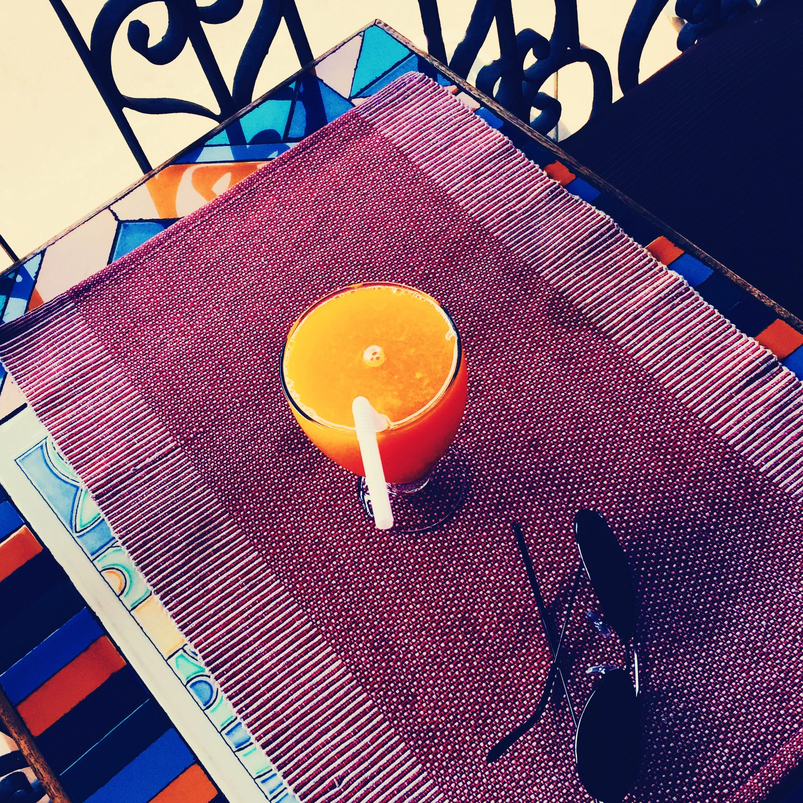

+++
title = 'Fontainhas - the Hidden Portugal'
description = 'Discover the charm of Fontainhas, a quaint neighborhood in Goa reminiscent of Portugal, with its vibrant streets, colonial architecture, and rich cultural heritage.'
date = 2024-06-16T12:18:54Z
draft = false
categories = ["Travel" ]
tags = [ "goa", "india", "travel", "fontainhas", "portugal", "culture", "heritage", "architecture", "photography" ]
showViews = true
showLikes = true
showComments = true
+++

Amidst the hectic life of the capital, hides she, draped in vibrant colors, set
beside the Mandovi river in an idyllic lifestyle of its own; the little known
small colony of Fontainhas, an old Latin quarter in Panjim, is styled with its
aura of difference.

After 50 years of independent Goa, the small town has well maintained the
definition of ‘sossegado’; the architecture, winding lanes, blue cornered white
marble stone name plates on the colorful walls, the food, the language spoken
and the serene silence of the area takes you for ride through time and history.

Diversified in beauty ,a walk around the town, takes you uphill to the Althino
Hills, the office of the Consulate General of Portugal; while the ancient creek
Rue de Ourem marks the eastern end of the border.

The perfect weekend getaway, I packed my bags and boarded a bus to
Panjim(Fontainhas is ten minutes walk from the main bus stand). Pre-booked a bed
in the dorm in the
[Old Latin Quarters](https://thehostelcrowd.com/oldquarterhostel/); reaching
Fontainhas, I dumped my backpack and left with my camera and an empty stomach.

The moment I stepped my foot in Fontainhas, I knew I had to throw my entire
research and plan out of the window. One week of research of places to eat ,
places to visit and itinenary to the very last minute was flushed away in a
blink; but ain’t that the beauty of solo travelling – immense and uncountable,
unrecognised possilibilites, the unfathomable joy in seeing the unseen unfold by
the second in front of your eyes.

Fontainhas not only surprises you with cultural heritage and history, but also
embraces you with culinary diversity and many heritage buildings turned into
hotels and food joints, hidden well inside the labyrinth. Places like Venite,
The Panjim Inn(generally known as The Verandah Restaurant), The Black Sheep
Bistro and many others are places to grab a bite while in town.

 
    
    
    
    
     


[Venite](https://www.tripadvisor.in/Restaurant_Review-g303877-d1194309-Reviews-Hospedaria_Venite-Panjim_North_Goa_District_Goa.html)
is the place I spend most of my lunch and dinner time in; the little balcony
sitting overlooking the little and dim lit lanes, the variety of food and meat
preparations in Goan/Portueguese style served with a pint of cold beer is
something one can only dream for after a whole day hike in scorching sun around
the town. This is a must visit place if nearby; do drop by to see for yourself
(you can get food and drinks in almost most conrners, but the stories printed on
the walls of this place is ……..)

People keep asking,”What would be perfect weekend getaway”. Well I dont know
about perfect, but this little ‘Eden‘ inside the connundrum of daily life made
me skip a heart beat. Keep your backpack ready and boots cleaned, perfection
would be followed by surprises.

Lets count our age in miles that we cover.

The best part of travelling solo is waving hello as strangers on the way and
call them friends; thanks Richard for the drink and hope to cross paths soon and
hear all your travel stories over a drink. Untill next time, have a safe trip
mate…….

## License

**Content License:** This work is licensed under the
[Creative Commons Attribution-NonCommercial-NoDerivatives 4.0 International License](http://creativecommons.org/licenses/by-nc-nd/4.0/).
You are free to share this content as long as it is attributed to me,
non-commercial in nature, and remains unaltered.

A copy of the same can be found
[here](https://github.com/priyakdey/priyakdey.github.io/blob/main/LICENSE).

## Disclaimer

This content has been written back in June 29, 2017. This is a port of the
article from
[ageinmiles.wordpress.com/](https://ageinmiles.wordpress.com/2017/06/29/fontainhas-the-hidden-portugal/)
