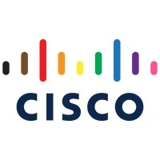
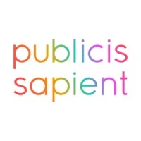

+++
title = "Resume"
date = 2022-06-13T20:55:37+01:00
draft = false
showDate  = false
showDateUpdated  = false
showHeadingAnchors  = false
showPagination  = false
showReadingTime  = false
showTableOfContents  = true
showTaxonomies  = false
showWordCount  = false
showSummary  = false
sharingLinks  = false
showEdit = false
showViews = false
showLikes = false
showAuthor = false
+++

## Experience

<table class="resume-table">
    <thead>
        <tr>
            <th>Company</th>
            <th>Link</th>
            <th>Role</th>
            <th>Project</th>
            <th>Dates</th>
            <th>Location</th>
        </tr>
    </thead>
    <tbody>
        <tr>
            <td></td>
            <td><a href="https://www.capitalone.com/" target="_blank">Capital One</a></td>
            <td>Lead Software Engineer</td>
            <td>ML Platform Engineering</td>
            <td>Jan, 2026 - <i>Present</i></td>
            <td>Bangalore, India</td>
        </tr>
        <tr>
            <td></td>
            <td><a href="https://www.visa.co.in/" target="_blank">Visa Inc.</a></td>
            <td>Staff Software Engineer</td>
            <td><a href="https://authorize.net" target="_blank">Authorize.net</a></td>
            <td>May, 2024 - Jan, 2026</td>
            <td>Bangalore, India</td>
        </tr>
        <tr>
            <td></td>
            <td><a href="https://www.appdynamics.com/" target="_blank">Cisco (Appdynamics)</a></td>
            <td>Software Engineer</td>
            <td><a href="https://www.appdynamics.com/" target="_blank">Appdynamics</a></td>
            <td>Oct, 2022 - May, 2024</td>
            <td>Bangalore, India</td>
        </tr>
        <tr>
            <td></td>
            <td><a href="https://www.morganstanley.com/" target="_blank">Morgan Stanley</a></td>
            <td>Software Engineering Manager</td>
            <td>Corporate Retirement Plan (401K)</td>
            <td>Jun, 2021 - Oct, 2022</td>
            <td>Bangalore, India</td>
        </tr>
        <tr>
            <td></td>
            <td><a href="https://www.publicissapient.com/" target="_blank">Publicis Sapient</a></td>
            <td>Senior Associate</td>
            <td>Corporate Retirement Plan (401K)</td>
            <td>May, 2022 - Jun, 2021</td>
            <td>Bangalore, India</td>
        </tr>
        <tr>
            <td></td>
            <td><a href="https://www.techmahindra.com/" target="_blank">Tech Mahindra</a></td>
            <td>Senior Software Engineer</td>
            <td>British Telecom</td>
            <td>Apr, 2019 - Sep, 2019</td>
            <td>Pune, India</td>
        </tr>
        <tr>
            <td rowspan=5></td>
            <td rowspan=5><a href="https://www.infosys.com/" target="_blank">Infosys</a></td>
        </tr>
        <tr>
            <td>Technology Analyst</td>
            <td>Jan, 2019 - Apr, 2019</td>
            <td>UBS</td>
            <td>Pune, India</td>
        </tr>
        <tr>
            <td>Senoir System Engineer</td>
            <td>Jun, 2016 - Dec, 2018</td>
            <td>UBS   Telstra</td>
            <td>Pune, India</td>
        </tr>
        <tr>
            <td>System Engineer</td>
            <td>Jun, 2015 - Jun, 2016</td>
            <td>Telstra</td>
            <td>Pune, India</td>
        </tr>
        <tr>
            <td>System Engineer Trainee</td>
            <td>Jan, 2015 - Jun, 2015</td>
            <td>Training</td>
            <td>Mysore, India</td>
        </tr>
    </tbody>
</table>

---

## Certifications

<table class="certification-table">
    <thead>
        <tr>
            <th>Certification</th>
            <th>Issuer</th>
            <th>Valid Till</th>
            <th>Badge / Verification Link</th>
        </tr>
    </thead>
    <tr>
        <td>
            <a href="https://www.credly.com/badges/77d9dc85-6e41-43a7-84ba-aedaa2dc4daa/public_url" target="_blank">
                Microsoft Certified: Azure Fundamentals
            </a>
        </td>
        <td>Microsoft</td>
        <td></td>
        <td>2nd Sep, 2020 - Present</td>
        <td>
            

            

            
        </td>
    </tr>
</table>

---

## Education

<table class="education-table">
    <thead>
        <tr>
            <th>University/School</th>
            <th>Degree</th>
            <th>Date</th>
            <th>GPA/Percentage</th>
        </tr>
    </thead>
    <tr>
        <td>Techno India College Of Technology</td>
        <td>Bachelor of Technology   <em>Electronics and Communication</em></td>
        <td>2010 - 2014</em></td>
        <td>8.50</em></td>
    </tr>
</table>
